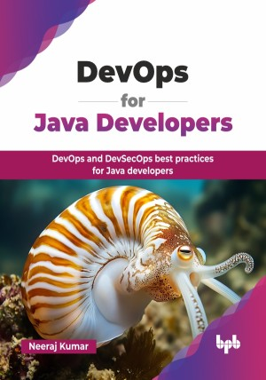

# DevOps for Java Developers

DevOps and DevSecOps best practices for Java developers.

This is the repository for [DevOps for Java Developers
](https://bpbonline.com/products/devops-for-java-developers?_pos=1&_sid=908166898&_ss=r&variant=44542799544520?variant=44542799544520),published by BPB Publications.

## About the Book
Java's robust ecosystem, encompassing Spring Boot, Micronaut, and Quarkus, thrives within modern microservices architectures, making DevOps practices essential for efficient development and deployment. This book serves as a comprehensive guide, starting with the foundational principles of DevOps and its real-world applications within Java-centric environments.

It helps you take advantage of microservices, serverless, and cloud-native technologies using the latest DevOps techniques to simplify your build process and create a service or application faster. It explores how breaking down monolithic applications into microservices can accelerate changes and enhance flexibility. This book covers core DevOps concepts, including source code management tools, continuous integration (CI), continuous deployment (CD), and containerization. It also introduces Mobile DevOps, emphasizing the growing need for DevOps in mobile app development. With security being critical, it covers DevSecOps practices to address vulnerabilities. Additionally, this book dives into package management, guiding you through storing and publishing software artifacts. 

By the end of this book, you will be well-equipped to integrate DevOps practices seamlessly into your Java development workflow. You will unlock faster software delivery cycles, improved code quality, and a more collaborative development environment. 

## What You Will Learn
• Understand the key principles of DevOps, its best practices, and the tools that speed up software development.

• Learn to use microservices, serverless, and cloud-native technologies for efficient app 
development.

• Discover how to break down complex applications into microservices for quicker updates.

• Master core DevOps components like source code management, containers, CI/CD, and deployment.

• Gain knowledge of DevSecOps strategies to secure software against cyber threats and manage software artifacts efficiently.

• Discover how to design fast and efficient DevOps workflows specifically for mobile development.
